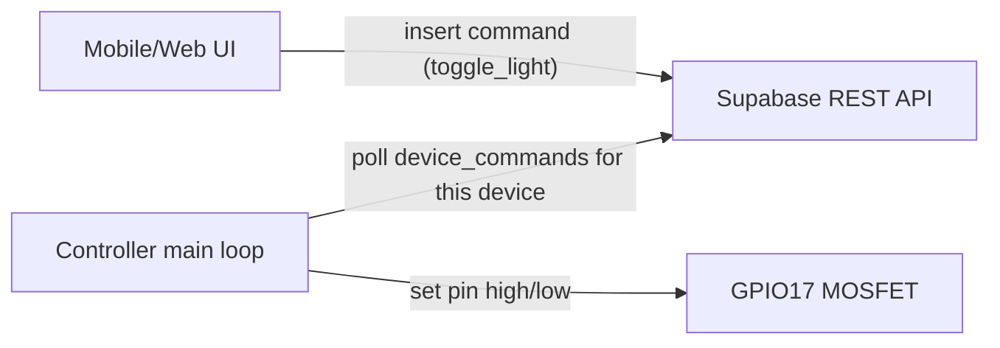

## Goal

Add support for toggling the 24V grow lights driven by the MOSFET on GPIO17 from the PhytoPi dashboard/mobile UI, using the existing Supabase-centric topology so that control works from both web and mobile.

**Assumptions**

- **Hardware**: The light MOSFET gate is wired to Raspberry Pi **BCM GPIO17** on `gpiochip0` (same numbering scheme as `DHT22_PIN` in `[PhytoPI_Controler/lib/gpio.h](PhytoPI_Controler/lib/gpio.h)`).
- **Device identity**: The controller already runs with a valid `SUPABASE_DEVICE_ID`, `SUPABASE_URL`, and `SUPABASE_ANON_KEY` env vars (matching the schema in `Data_Infraestructure/supabase`).
- **Command path**: We will use **Supabase** as the command transport (new `device_commands` table that the controller polls) rather than a direct HTTP API on the Pi.

## High-level architecture

- **UI**: Add a "Grow Lights" test toggle button in the main dashboard view that writes a command row for the selected device.
- **Supabase**: Introduce a `device_commands` table with minimal RLS so authenticated app users can enqueue commands for devices they own/share.
- **Controller**: Extend the C controller to initialize GPIO17 as an output, periodically poll `device_commands` for pending `toggle_light` commands for its `device_id`, and apply them to the MOSFET, marking commands as processed.

## Controller changes (C side)

1. **GPIO abstraction for lights**
  - Update `[PhytoPI_Controler/lib/gpio.h](PhytoPI_Controler/lib/gpio.h)` to add a `#define LIGHTS_PIN 17` (BCM numbering) and function declarations for light control, e.g. `int lights_init(void); int lights_set(int on);`.
  - Extend `[PhytoPI_Controler/src/gpio.c](PhytoPI_Controler/src/gpio.c)` to:
    - Maintain a separate `gpiod_line` * for the lights pin (do **not** interfere with the DHT22 logic which uses its own line).
    - Implement `lights_init()` that opens `gpiochip0`, gets the `LIGHTS_PIN` line, and requests it as an output (initially OFF).
    - Implement `lights_set(int on)` that sets the line value (1 = ON, 0 = OFF), and a `lights_cleanup()` called from `gpio_cleanup()`.
2. **Supabase command polling helper**
  - Add a new C module, e.g. `[PhytoPI_Controler/src/commands.c](PhytoPI_Controler/src/commands.c)` with header `[PhytoPI_Controler/lib/commands.h](PhytoPI_Controler/lib/commands.h)` to keep this logic isolated.
  - Using libcurl (already in use in `[PhytoPI_Controler/src/supabase.c](PhytoPI_Controler/src/supabase.c)`), implement:
    - `int fetch_next_light_command(const supabase_config_t *cfg, int *desired_state);`
      - Issues a `GET` against `"<SUPABASE_URL>/rest/v1/device_commands"` with query parameters like `device_id=eq.<device_id>&command_type=eq.toggle_light&status=eq.pending&order=created_at.asc&limit=1`.
      - Parses the JSON response (via `json-c`) to extract the requested light state from `payload->state` (0/1 or false/true) into `*desired_state`.
      - Returns 1 if a command was found, 0 if none, and <0 on error.
    - `int mark_light_command_processed(const supabase_config_t *cfg, const char *command_id, const char *status);`
      - Sends a `PATCH` update to mark the command as `executed` (or `failed`) and set `executed_at`.
  - Reuse the API key handling patterns from `supabase_send_batch` for headers and base URL building.
3. **Integrate into main loop**
  - In `[PhytoPI_Controler/src/main.c](PhytoPI_Controler/src/main.c)`:
    - After Supabase initialization succeeds, call `lights_init()` once and track a `int lights_on = 0;` state variable.
    - Extend the main `while (1)` loop to, on a slower cadence than sensor reads (e.g. every 2–5 seconds):
      - Call `fetch_next_light_command()`; if it returns a new desired state, call `lights_set(desired_state)` and update the local `lights_on` variable.
      - Mark the command as `executed` via `mark_light_command_processed()`.
    - Ensure proper cleanup by calling the updated `gpio_cleanup()` which in turn releases the light line.
  - Add logging around command handling so you can see in stdout when commands arrive and the lights are toggled.
4. **Build system updates**
  - Update `[PhytoPI_Controler/Makefile](PhytoPI_Controler/Makefile)` to:
    - Compile and link the new `commands.c` (and `commands.h`) module.
    - Link with `json-c` and `curl` if not already pulled in transitively for the main binary.

## Supabase schema changes

1. **Create `device_commands` table**
  - Add a migration under `Data_Infraestructure/supabase/migrations/` (e.g. `20260227000001_create_device_commands.sql`) that defines:
    - `id uuid primary key default gen_random_uuid()`
    - `device_id uuid not null references public.device_units(id)`
    - `command_type text not null` (e.g. `toggle_light`)
    - `payload jsonb not null` (for arbitrary command parameters; here `{ "state": true }`)
    - `status text not null default 'pending'` (e.g. `pending|executed|failed`)
    - `created_at timestamptz default now()`
    - `executed_at timestamptz null`
2. **Row Level Security and policies**
  - In the same migration, enable RLS on `device_commands` and add policies similar to `readings` and `alerts`:
    - Owners and sharees (via `user_has_device_access(device_id, auth.uid())`) can **insert** command rows for devices they can access.
    - Owners/sharees can **select** command rows for their devices (for debugging or history views).
    - Device agents (using the anon or service key as appropriate for your deployment) can **select** pending commands for their own `device_id`.
    - Optionally restrict **update** of `status`/`executed_at` to device agents only.
3. **Config constants for UI**
  - Optionally add a new constant in `[User_Interface/lib/core/config/supabase_config.dart](User_Interface/lib/core/config/supabase_config.dart)` for this table name, e.g. `static const String deviceCommandsTable = 'device_commands';`.

## Flutter UI & app logic

1. **Add a simple device control API in Flutter**
  - Extend `[User_Interface/lib/features/dashboard/providers/device_provider.dart](User_Interface/lib/features/dashboard/providers/device_provider.dart)` with a method such as:
    - `Future<void> toggleGrowLights(bool on)` which:
      - Validates that Supabase is initialized and a `selectedDevice` exists.
      - Inserts into `SupabaseConfig.deviceCommandsTable` a row `{ 'device_id': selectedDevice.id, 'command_type': 'toggle_light', 'payload': { 'state': on } }`.
      - Handles errors by updating `_error` and optionally rethrowing for the UI to display a `SnackBar`.
  - For now, avoid listening to command status from the app; treat it as fire-and-forget for a test button.
2. **Expose a "Grow Lights" button in the dashboard**
  - In `[User_Interface/lib/features/dashboard/screens/dashboard_screen.dart](User_Interface/lib/features/dashboard/screens/dashboard_screen.dart)`, inside `_buildDashboardContent` in the `if (selectedDevice != null) ...` section, add:
    - A small control row above the gauges (e.g. between lines 424–426) containing a `FilledButton.icon` or `Switch` labeled **"Grow Lights Test"**.
    - Maintain a local `_lightsOn` state in `_DashboardScreenState` (or derive from last sent command if you prefer) that flips when the button is pressed.
    - On press/changed, call `context.read<DeviceProvider>().toggleGrowLights(!_lightsOn)` and optimistically update `_lightsOn`.
  - Ensure this control appears in both web and mobile layouts (since `_buildDashboardContent` is shared, this comes for free).
3. **(Optional) Feedback to user**
  - On success/failure of `toggleGrowLights`, show a brief `SnackBar` such as "Grow lights ON command sent" or an error message.
  - Optionally grey-out the button when `DeviceProvider.isLoading` or when no device is selected.

## Testing & verification

1. **Local controller testing on Pi**
  - Build and deploy the updated controller binary on the Pi, ensuring `SUPABASE_URL`, `SUPABASE_ANON_KEY`, and `SUPABASE_DEVICE_ID` are set.
  - Temporarily enable verbose logging for command polling and GPIO writes.
  - From a Supabase SQL console or REST client, manually insert a `device_commands` row for the device and verify the light toggles and command is marked `executed`.
2. **End-to-end UI test (mobile/web)**
  - Run `User_Interface/scripts/dev/run_local.sh` to start the Supabase dev stack and Flutter web app (or run Flutter on a physical mobile device pointing to your Supabase instance).
  - Pair/claim a device so that `selectedDevice` is non-null on the dashboard.
  - Press the "Grow Lights Test" button and confirm:
    - A new `device_commands` row is inserted in Supabase for that device.
    - The controller running on the Pi receives and applies the command (lights physically toggle).
3. **Edge cases**
  - Verify behavior when Supabase is not configured: the button should either be hidden or show a "Not configured" message instead of failing.
  - Ensure the controller handles transient Supabase errors (e.g., network down) by logging and retrying without exiting the loop.

## Future enhancements (optional)

- Add **command history** to the app, showing recent light toggles and statuses per device.
- Generalize `device_commands` to support other actuators (pumps, fans) by introducing structured `command_type` enums and standardized `payload` schemas.
- Add a simple safety guard (e.g., maximum ON duration for test mode) in the controller to avoid accidentally leaving lights on indefinitely if commands stop flowing.

