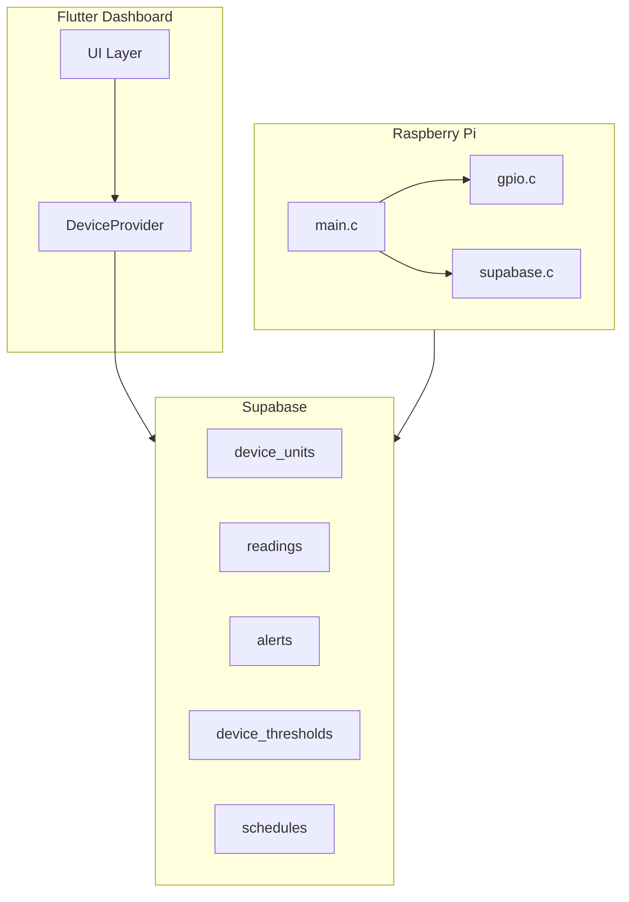

# PhytoPi 9 Epics Implementation Plan

## Architecture Context

**Current state:** REST (Supabase PostgREST), no MQTT. Pi polls commands every 2s, syncs readings every 5s, fetches thresholds/schedules every 60s. No `last_seen` on devices; `status` is static.

---

## Epic A — Configurable Thresholds (UI + Storage + Device Sync)

### Current State

- Table `device_thresholds` exists: `metric`, `min_value`, `max_value`, `enabled` ([20260228000001_phytopi_extension.sql](Data_Infraestructure/supabase/migrations/20260228000001_phytopi_extension.sql))
- Pi fetches thresholds every 60s and evaluates (temp, humidity, pressure, gas, water_level_low)
- UI: AlertsScreen Thresholds tab shows "Threshold config coming soon"

### Schema Changes

- **Optional:** Add `warning_min`, `warning_max`, `critical_min`, `critical_max` to `device_thresholds` for warning vs critical bands (or use `severity` in payload). Simpler: keep min/max, add `severity` column (warning/critical) per threshold.
- Migration: `ALTER TABLE device_thresholds ADD COLUMN IF NOT EXISTS severity text DEFAULT 'critical';`

### Tasks

1. **UI:** Build Thresholds tab in [alerts_screen.dart](User_Interface/lib/features/dashboard/screens/alerts_screen.dart) — list/create/edit/delete thresholds per metric (temp_c, humidity, pressure, gas_resistance, water_level_low, soil_moisture, light_lux)
2. **State:** Add `_thresholds` to DeviceProvider, fetch from `device_thresholds`, cache locally; subscribe to Realtime or poll on tab focus
3. **Device sync:** Pi already fetches every 60s — no change. Ensure UI writes to Supabase; Pi picks up on next fetch
4. **Charts/alerts:** Apply threshold bands to [dashboard_chart.dart](User_Interface/lib/features/dashboard/widgets/dashboard_chart.dart) (optional range overlays) and alert severity from threshold

### Files Affected

- `User_Interface/lib/features/dashboard/screens/alerts_screen.dart`
- `User_Interface/lib/features/dashboard/providers/device_provider.dart`
- `Data_Infraestructure/supabase/migrations/` (new migration for severity if needed)

### Test Plan

- Create threshold for temp_c (min 15, max 35) — persists after refresh
- Edit threshold — Pi receives updated values within 60s
- Delete threshold — Pi stops evaluating
- Breach triggers alert; chart shows threshold line (if implemented)

### Definition of Done

User can create/edit/delete thresholds; they persist; device receives updates without reboot; thresholds drive alerts and optionally chart highlighting.

---

## Epic B — Configurable Schedules (UI + Scheduler Execution)

### Current State

- Table `schedules` exists: `schedule_type` (lights, pump, ventilation), `cron_expr`, `interval_seconds`, `payload` ([20260228000001_phytopi_extension.sql](Data_Infraestructure/supabase/migrations/20260228000001_phytopi_extension.sql))
- Pi evaluates schedules every 60s; supports cron `"min hour"` and `"*/n"` patterns; payload: `state`, `duration_sec`, `duty_percent`
- UI: "Schedules coming soon"

### Schema Changes

- Add `last_run_at` to `schedules` (optional, for UI display): `ALTER TABLE schedules ADD COLUMN IF NOT EXISTS last_run_at timestamptz;`
- Pi would need to UPDATE `last_run_at` after execution — requires RLS policy for anon UPDATE on schedules (or use a separate `schedule_runs` log table)

### Tasks

1. **UI:** Build Schedules tab — create recurring schedules: daily/weekly, start/end times, duration, target action (lights, pump, ventilation)
2. **Payload mapping:** Map UI to `schedule_type` + `payload` (e.g. `{"state": true, "duration_sec": 30}` for pump)
3. **Cron/interval:** Support `cron_expr` (e.g. "0 8 * * *" for 8:00 daily) and `interval_seconds` for fixed intervals
4. **Device:** Pi already runs schedules; persist `last_run_at` via new RLS + Pi UPDATE call
5. **Survive reboots:** Pi fetches schedules on startup; run_cache is in-memory but schedules re-run correctly by cron/interval

### Files Affected

- `User_Interface/lib/features/dashboard/screens/alerts_screen.dart`
- `User_Interface/lib/features/dashboard/providers/device_provider.dart`
- `PhytoPI_Controler/src/supabase.c` (add `supabase_update_schedule_last_run`)
- `PhytoPI_Controler/src/main.c` (call update after schedule run)
- `Data_Infraestructure/supabase/migrations/` (last_run_at, RLS for devices UPDATE)

### Test Plan

- Create lights schedule 8:00 daily — triggers at 8:00 (device local time)
- Create pump schedule with 30s duration — runs, then auto-off
- Reboot Pi — schedules still execute
- UI shows last run time

### Definition of Done

User creates schedules; they trigger at correct times; survive reboots; UI shows status and last run.

---

## Epic C — AI Health Camera Livestream (Zero Reconfigure)

### Current State

- **AI Health screen** ([ai_health_screen.dart](User_Interface/lib/features/dashboard/screens/ai_health_screen.dart)): Shows AI capture jobs (static image + diagnostic) — no livestream
- **Camera screen** ([camera_screen.dart](User_Interface/lib/features/dashboard/screens/camera_screen.dart)): MJPEG stream with manual URL input (`http://phytopi.local:8000/stream.mjpg`)
- **Stream script** ([stream_camera_web.py](PhytoPI_Controler/scripts/stream_camera_web.py)): Uses rpicam-vid/libcamera-vid/raspivid; hardcoded `/dev/video0` for ffmpeg fallback; no USB auto-detect

### Approach

- **Stream:** MJPEG is simplest and already works. Keep it.
- **Auto-detect:** Enhance `stream_camera_web.py` to probe `/dev/video`* (v4l2) and pick first usable camera
- **Stable endpoint:** Run as systemd service (Epic I); always on port 8000
- **AI Health page:** Add livestream section above/beside AI capture — embed MjpegView with device-derived stream URL (from device config or `http://<device-ip>:8000/stream.mjpg`)
- **Recovery:** Poll/retry on stream failure; show loading/live/disconnected/retry states

### Tasks

1. **stream_camera_web.py:** Add USB camera auto-detect (list `/dev/video`*, try each until one works); handle disconnect/reconnect loop (restart capture on failure)
2. **Device stream URL:** Store `stream_url` in device metadata or derive from device IP (if available). Fallback: `phytopi.local:8000` or config in `.env.kiosk`
3. **AI Health screen:** Add MjpegView with auto-connect; states: loading, live, disconnected, retry button
4. **MjpegView:** Add error handling, retry on disconnect, optional reconnection interval

### Files Affected

- `PhytoPI_Controler/scripts/stream_camera_web.py`
- `User_Interface/lib/features/dashboard/screens/ai_health_screen.dart`
- `User_Interface/lib/features/dashboard/widgets/mjpeg_view.dart`, `mjpeg_web.dart`, `mjpeg_mobile.dart`
- `User_Interface/lib/.env.kiosk` or device config for stream URL

### Test Plan

- Open AI Health — video appears within seconds
- Disconnect USB camera — UI shows disconnected
- Reconnect — stream recovers without app restart
- Reboot Pi — stream endpoint works

### Definition of Done

AI Health shows livestream; auto-detects camera; recovers on disconnect/reconnect; no manual URL each session.

---

## Epic D — Alerts: Close + History Archive

### Current State

- `alerts` table has `resolved_at` ([20250120000002_create_data_tables.sql](Data_Infraestructure/supabase/migrations/20250120000002_create_data_tables.sql))
- AlertsScreen shows all alerts; resolved ones get grayed chip
- No "Close" action; no separate History view

### Schema Changes

- Use `resolved_at` as "closed" timestamp. Add RLS policy for authenticated users to UPDATE alerts (set `resolved_at = now()`). Pi (anon) can INSERT only.

### Tasks

1. **Close action:** Add "Close" button on unresolved alerts; call `SupabaseConfig.client!.from('alerts').update({'resolved_at': DateTime.now().toIso8601String()}).eq('id', id)`
2. **RLS:** Add policy "Owners can update alerts (resolve)" for UPDATE with `resolved_at` only
3. **UI split:** Alerts tab — active (resolved_at IS NULL); new "Alert History" section/tab — resolved, with created, closed, metric, device, severity, message
4. **Subscribe to UPDATE:** Extend `_subscribeToAlerts` to listen for UPDATE so closed alerts move immediately
5. **Filtering:** History filter by date, device, severity

### Files Affected

- `User_Interface/lib/features/dashboard/screens/alerts_screen.dart`
- `User_Interface/lib/features/dashboard/providers/device_provider.dart`
- `Data_Infraestructure/supabase/migrations/` (RLS for alerts UPDATE)

### Test Plan

- Close alert — disappears from active, appears in history
- History persists across sessions
- Filter by date/device/severity works

### Definition of Done

Close removes from active; history persists; filterable.

---

## Epic E — Charts: All Readings + Better Interaction

### Current State

- Charts: temp, humidity, light, soil, water, pressure, gas ([dashboard_screen.dart](User_Interface/lib/features/dashboard/screens/dashboard_screen.dart), [charts_screen.dart](User_Interface/lib/features/dashboard/screens/charts_screen.dart))
- `DashboardChart` uses fl_chart; fixed minY/maxY; no pan/zoom; tooltip has timestamp + value
- `_maxHistoryPoints = 10000` in DeviceProvider

### Tasks

1. **All metrics:** Ensure every sensor type from `sensor_types` used by device has a chart (temp_c, humidity, pressure, gas_resistance, water_level_frequency, soil_moisture, light_lux)
2. **Default full-range:** Compute minY/maxY from data when empty; allow auto-scale
3. **Pan/zoom:** fl_chart supports `LineTouchData` and `zoomEnabled` — enable interactive pan/zoom
4. **Range selector:** Add chips (24h, 7d, 30d, custom) to filter `_historicalReadings` by time window before passing to chart
5. **Downsampling:** When points > 500, downsample (e.g. LTTB or simple decimation) before rendering
6. **Tooltip:** Already has timestamp + value; ensure format is clear

### Files Affected

- `User_Interface/lib/features/dashboard/widgets/dashboard_chart.dart`
- `User_Interface/lib/features/dashboard/screens/dashboard_screen.dart`
- `User_Interface/lib/features/dashboard/screens/charts_screen.dart`
- `User_Interface/lib/features/dashboard/providers/device_provider.dart`

### Test Plan

- Each sensor metric has chart
- Zoom/pan works; reset view works
- 24h/7d/30d filters work
- Large dataset doesn't freeze UI

### Definition of Done

All metrics charted; zoom/pan; range selector; performant with large data.

---

## Epic F — Water Level 5-State Gauge (Frequency Mapping)

### Current State

- Photoelectric sensor on GPIO26; `read_photoelectric_water_level()` returns raw Hz ([gpio.c](PhytoPI_Controler/src/gpio.c))
- Mapping: 20 Hz = empty, 50/100/200/400 Hz = DP1–DP4
- Pi stores raw Hz in `water_level_photoelectric`; syncs to Supabase
- UI shows continuous 0–100% water gauge

### Frequency Bands (with hysteresis)

| State | Label | Hz Range | Midpoint |
| ----- | ----- | -------- | -------- |
| 0     | Empty | < 35     | 20       |
| 1     | Low   | 35–75    | 50       |
| 2     | Mid   | 75–150   | 100      |
| 3     | High  | 150–300  | 200      |
| 4     | Full  | > 300    | 400      |

Use band boundaries with ±5–10 Hz hysteresis to avoid jitter.

### Tasks

1. **Pi:** In `main.c`, add `frequency_to_water_state(int hz)` returning 0–4; apply hysteresis (store last_state, only change when clearly in new band)
2. **Sync:** Option A: Store discrete state (0–4) in readings for `water_level_frequency` sensor. Option B: Store raw Hz + state in metadata. Prefer storing state as value for gauge simplicity.
3. **UI:** Replace continuous water gauge with discrete 5-level gauge (Empty, Low, Mid, High, Full) — use `DashboardGauge` with 5 discrete ticks or custom widget
4. **Debug:** Optional query param or settings toggle to show raw Hz

### Files Affected

- `PhytoPI_Controler/src/main.c`
- `PhytoPI_Controler/src/gpio.c` (optional: expose mapping)
- `User_Interface/lib/features/dashboard/widgets/dashboard_gauge.dart` or new `WaterLevelGauge`
- `User_Interface/lib/features/dashboard/screens/dashboard_screen.dart`

### Test Plan

- 20 Hz → Empty; 50 Hz → Low; etc.
- Jitter around boundary doesn't oscillate
- Debug mode shows raw Hz

### Definition of Done

5 discrete levels; hysteresis prevents oscillation; optional raw Hz in debug.

---

## Epic G — Remove Light Gauge

### Current State

- Light gauge in [dashboard_screen.dart](User_Interface/lib/features/dashboard/screens/dashboard_screen.dart) lines 598–609

### Tasks

1. Remove the Light Level `DashboardGauge` widget from dashboard_screen.dart
2. Remove light_lux from demo simulation if only used for gauge (keep for charts)
3. Grep for "light_lux" gauge-specific references; remove dead code
4. Keep light chart — only remove gauge

### Files Affected

- `User_Interface/lib/features/dashboard/screens/dashboard_screen.dart`

### Test Plan

- Light gauge not visible
- No broken references

### Definition of Done

Light gauge removed; no dead code.

---

## Epic H — Devices Page: Correct Offline Status

### Current State

- `device_units` has `status`, `updated_at`; no `last_seen`
- `Device.isOnline` = `(status == 'active') || is_online` ([device_model.dart](User_Interface/lib/features/dashboard/models/device_model.dart))
- Pi does NOT update `device_units` when syncing — only inserts readings

### Schema Changes

- Add `last_seen timestamptz` to `device_units`
- Pi: On each successful sync (or every N seconds), PATCH `device_units SET last_seen = now() WHERE id = ?`
- RLS: Allow anon (Pi) to UPDATE `device_units` for its own device (by device_id from credentials)

### Tasks

1. **Migration:** `ALTER TABLE device_units ADD COLUMN IF NOT EXISTS last_seen timestamptz;`
2. **Pi:** Add `supabase_heartbeat(config, device_id)` — PATCH last_seen; call every sync or every 30s
3. **Device model:** `isOnline = (last_seen != null && DateTime.now().difference(lastSeen) < Duration(seconds: 90))` (or use `status` + last_seen)
4. **Realtime:** Subscribe to `device_units` changes so UI updates when last_seen changes
5. **Timeout:** Define 60–90s; if no update within that window, show offline

### Files Affected

- `Data_Infraestructure/supabase/migrations/` (last_seen, RLS for anon UPDATE)
- `PhytoPI_Controler/src/supabase.c` (heartbeat)
- `PhytoPI_Controler/src/main.c` (call heartbeat)
- `User_Interface/lib/features/dashboard/models/device_model.dart`
- `User_Interface/lib/features/dashboard/providers/device_provider.dart` (subscribe to device_units, compute isOnline from last_seen)

### Test Plan

- Pi online — UI shows green within 90s
- Disconnect Pi — UI shows red within 90s
- Reconnect — UI shows green
- Multiple clients see same state

### Definition of Done

Offline within 30–90s; online when Pi syncs; consistent across clients.

---

## Epic I — Clone Pi Services + SD Copy

### Current State

- No systemd services; controller runs as standalone binary
- Stream script runs manually
- No documented clone procedure

### Tasks

1. **systemd units:**
  - `phytopi-controller.service` — runs `PhytoPI_Controler/build/phytopi_controller` (or equivalent)
  - `phytopi-stream.service` — runs `stream_camera_web.py`
  - Optional: `phytopi-capture.service` for AI capture script if separate
2. **Clone script:** Bash script that:
  - Exports env vars, device_id, Supabase URL/key from current Pi
  - Creates tarball of config + binaries
  - Outputs instructions for second SD: copy tarball, extract, set env, run services
3. **Docs:** `PhytoPI_Controler/CLONE_PI.md` with step-by-step clone procedure

### Files Affected

- `PhytoPI_Controler/systemd/phytopi-controller.service` (new)
- `PhytoPI_Controler/systemd/phytopi-stream.service` (new)
- `PhytoPI_Controler/scripts/clone_pi.sh` (new)
- `PhytoPI_Controler/CLONE_PI.md` (new)

### Test Plan

- Services start on boot
- Second Pi boots with same config
- Documented procedure works end-to-end

### Definition of Done

Services on boot; clone script + docs work.

---

## Implementation Notes

### Streaming (Epic C)

- **MJPEG** is simplest: no codec negotiation, works in browser. Keep it.
- Auto-detect: `ls /dev/video`* → try each with `v4l2-ctl --device=/dev/videoN --all` or open with OpenCV/ffmpeg to verify.
- Recovery: wrap capture loop in try/except; on failure, sleep 5s, re-detect camera, restart.

### Offline Detection (Epic H)

- **Heartbeat:** Pi PATCHes `device_units.last_seen` every sync (5s) or every 30s.
- **UI:** `isOnline = last_seen != null && now - last_seen < 90s`.
- **Realtime:** Subscribe to `device_units` for `last_seen` changes so all clients update.

### Recommended Order

1. **Epic G** (remove light gauge) — trivial
2. **Epic H** (offline) — unblocks reliable device UX
3. **Epic D** (alerts close/history) — quick win
4. **Epic A** (thresholds) — backend exists
5. **Epic B** (schedules) — backend exists
6. **Epic F** (water gauge) — contained
7. **Epic E** (charts) — UX improvement
8. **Epic C** (livestream) — depends on stream script + AI Health
9. **Epic I** (clone) — operational

