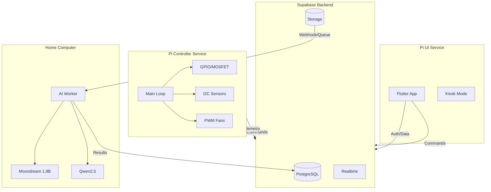

# PhytoPi Smart Grow Box Extension - Implementation Plan

## 1. Architecture Overview

---

## 2. GPIO / I2C / PWM Pin Plan

| Function                      | Pin(s)  | BCM  | Rationale                                     | Safety Notes                                    |
| ----------------------------- | ------- | ---- | --------------------------------------------- | ----------------------------------------------- |
| **Lights** (existing)         | GPIO17  | 17   | Already in use; 24V MOSFET low-side           | Keep as-is                                      |
| **Pump** (MOSFET)             | GPIO22  | 22   | Adjacent to 17; same switching pattern        | Low-side only; pump draws ~100mA @ 3V           |
| **Fan 1 PWM**                 | GPIO12  | 12   | Hardware PWM0; 5V fans, 25kHz typical         | PWM via MOSFET; no direct 5V to Pi              |
| **Fan 2 PWM**                 | GPIO13  | 13   | Hardware PWM1; independent from Fan 1         | Same as Fan 1                                   |
| **Photoelectric water level** | GPIO26  | 26   | Currently defined but unused; frequency input | 3.3V logic; interrupt-capable                   |
| **BME680** (I2C)              | SDA/SCL | 2, 3 | Standard I2C-1; addr 0x76 or 0x77             | Shares bus with ADS7830 (0x4b)                  |
| **ADS7830** (existing)        | SDA/SCL | 2, 3 | I2C-1; addr 0x4b                              | Ch0: soil, Ch1: light, Ch2: (repurpose or keep) |
| **DHT11** (removed)           | GPIO21  | 21   | Freed for future use                          | -                                               |

**Pin availability**: GPIO21, 23, 24, 25 remain free for future expansion (e.g., additional relays, status LEDs).

**I2C bus**: `/dev/i2c-1`. BME680 (0x76) + ADS7830 (0x4b) = no address conflict.

---

## 3. Data Model Changes (Supabase)

### 3.1 New Tables

`**device_thresholds`** – Configurable thresholds per device

- `id`, `device_id`, `metric` (temp_c, humidity, gas_resistance, water_level_low), `min_value`, `max_value`, `enabled`, `created_at`, `updated_at`

`**schedules`** – Cron-like or recurring schedules

- `id`, `device_id`, `schedule_type` (lights, pump, ventilation), `cron_expr` or `interval_seconds`, `payload` (jsonb: duration, state, etc.), `enabled`, `created_at`, `updated_at`

`**ai_capture_jobs`** – Image capture + AI pipeline state

- `id`, `device_id`, `image_url` (Supabase Storage), `status` (pending, processing, completed, failed), `vision_result` (jsonb), `llm_result` (jsonb), `created_at`, `processed_at`

### 3.2 Schema Extensions

`**sensor_types**` – Add: `pressure` (hPa), `gas_resistance` (kOhm), `voc_index` (optional)

`**readings**` – Already supports `value` + `metadata`; no change needed. BME680 will create 4 sensor types: temp_c, humidity, pressure, gas_resistance.

`**alerts**` – Add RLS policy for device/anon INSERT (Pi controller inserts alerts). Add `source` (manual, scheduled, automated, threshold).

`**device_commands**` – Extend `command_type`: `toggle_light`, `toggle_pump`, `toggle_fans`, `set_fan_speed`, `run_ventilation`, `capture_image`. Payload structure per type.

`**ml_inferences**` – Extend for AI workflow: add `diagnostic` (text), `tips` (jsonb array), `image_url`, `job_id` (FK to ai_capture_jobs).

### 3.3 Storage Bucket

- `device-images` – For captured plant images. RLS: device owners can read; Pi/service can write.

---

## 4. API / MQTT Topic Design

### 4.1 REST (Supabase) – Primary Path

**Commands (Pi polls)**  
`GET /rest/v1/device_commands?device_id=eq.{id}&status=eq.pending&order=created_at.asc&limit=10`

**Command types and payloads:**

- `toggle_light`: `{ "state": true|false }`
- `toggle_pump`: `{ "state": true|false, "duration_sec": 30 }` (optional auto-off)
- `toggle_fans`: `{ "state": true|false }`
- `set_fan_speed`: `{ "fan_id": 1|2, "duty_percent": 0-100 }`
- `run_ventilation`: `{ "duration_sec": 300, "duty_percent": 80 }`
- `capture_image`: `{}`

**Telemetry (Pi pushes)**  
`POST /rest/v1/readings` – Batch insert (existing pattern)

**Alerts (Pi pushes)**  
`POST /rest/v1/alerts` – Insert with `device_id`, `type`, `message`, `severity`, `metadata`

**Thresholds (Pi reads)**  
`GET /rest/v1/device_thresholds?device_id=eq.{id}`

**Schedules (Pi reads)**  
`GET /rest/v1/schedules?device_id=eq.{id}&enabled=eq.true`

### 4.2 MQTT (Optional Future)

- `phytopi/{device_id}/commands` – Subscribe for commands
- `phytopi/{device_id}/telemetry` – Publish sensor data
- `phytopi/{device_id}/alerts` – Publish alerts

*Recommendation*: Start with REST only; add MQTT in a later phase if latency or offline support becomes critical.

---

## 5. Notification Strategy

| Trigger                               | Payload                              | Dedupe / Rate-Limit                                    |
| ------------------------------------- | ------------------------------------ | ------------------------------------------------------ |
| Threshold exceeded (temp/hum/gas)     | `{ type, metric, value, threshold }` | Cooldown: 15 min per metric per device                 |
| Water level low                       | `{ type: "water_low" }`              | Cooldown: 30 min; persistent UI warning until resolved |
| Actuator triggered (lights/pump/fans) | `{ type, action, source }`           | No dedupe; log every execution                         |
| Schedule fired                        | `{ schedule_id, action }`            | No dedupe                                              |
| AI result ready                       | `{ job_id, diagnostic, tips }`       | One per job                                            |

**Implementation**: Supabase Edge Function or pg_notify + worker; Flutter subscribes to `alerts` realtime. Use `metadata.dedupe_key` + server-side cooldown table or in-memory cache.

---

## 6. Implementation Phases

### Phase 1: Pi Controller – Hardware + Core Logic (2–3 weeks)

**Tasks:**

1. Add BME680 I2C driver (replace DHT11); remove DHT code from [gpio.c](PhytoPI_Controler/src/gpio.c) and [main.c](PhytoPI_Controler/src/main.c)
2. Add PWM fan control (GPIO12, GPIO13) using Linux PWM sysfs or `pigpio`
3. Add pump MOSFET control (GPIO22) mirroring lights pattern
4. Add photoelectric water level driver (GPIO26, frequency detection via interrupt or timer)
5. Extend [commands.c](PhytoPI_Controler/src/commands.c) for `toggle_pump`, `toggle_fans`, `set_fan_speed`, `run_ventilation`
6. Add threshold evaluation loop; trigger ventilation + insert alert when exceeded
7. Add schedule evaluator (cron-like); execute lights/pump/fans per schedule
8. Update SQLite schema for new sensor tables (pressure, gas, water_level_photoelectric)
9. Update Supabase sync for new sensor types

**Acceptance criteria:**

- BME680 reports temp, humidity, pressure, gas; syncs to Supabase
- Fans respond to PWM (0–100%); pump toggles on/off
- Photoelectric sensor detects low water; inserts alert
- Threshold-based ventilation triggers and logs
- Schedules execute lights, pump, ventilation

**Test plan:**

- Sensor unplugged: BME680/I2C fail → log error, retain last values, no crash
- Pump stalled: Timeout after `duration_sec`; mark command failed
- Fan failure: No direct feedback; rely on schedule/command completion
- Water-level false positive: Debounce (e.g., 3 consecutive low readings over 10s); configurable in thresholds

---

### Phase 2: Backend – Schema + APIs (1 week)

**Tasks:**

1. Create migration: `device_thresholds`, `schedules`, `ai_capture_jobs`; extend `sensor_types`
2. Add RLS for `alerts` INSERT (anon/service for Pi)
3. Add RLS for `device_thresholds`, `schedules` (owners/sharees read; owners update)
4. Create `device-images` storage bucket + RLS
5. Extend `ml_inferences` schema for AI workflow
6. (Optional) Edge Function for notification dedupe/rate-limit

**Acceptance criteria:**

- Pi can insert alerts; Flutter can read
- Thresholds and schedules are readable by Pi and editable by owners
- Storage bucket accepts uploads from Pi/service role

---

### Phase 3: Flutter UI – Alerts/Commands Refactor (2 weeks)

**Tasks:**

1. Refactor [alerts_screen.dart](User_Interface/lib/features/dashboard/screens/alerts_screen.dart) into **Alerts/Commands** center:
  - Alerts feed (from `alerts` table, realtime)
  - Threshold config UI (temp, humidity, gas, water level)
  - Manual commands: lights, pump, fans (with duration for pump)
  - Scheduler UI (cron-like or simple recurring)
2. Move lights control from [dashboard_screen.dart](User_Interface/lib/features/dashboard/screens/dashboard_screen.dart) (lines 516–563) into Alerts/Commands
3. Add persistent water-level warning banner when `water_level_low` alert is unresolved
4. Extend [DeviceProvider](User_Interface/lib/features/dashboard/providers/device_provider.dart): `togglePump`, `toggleFans`, `setFanSpeed`, `runVentilation`
5. Subscribe to `alerts` realtime channel
6. Add gauge/chart for pressure and gas (from BME680)

**Acceptance criteria:**

- All actuator controls live under Alerts/Commands
- Thresholds editable; schedules creatable/editable
- Water-level warning visible when active
- Dashboard shows BME680 data (temp, humidity, pressure, gas)

---

### Phase 4: AI Image Capture + Recognition (2–3 weeks)

**Tasks:**

1. **Pi**: Add `capture_image` command handler; trigger camera capture (e.g., `libcamera-still` or existing [stream_camera_web.py](PhytoPI_Controler/scripts/stream_camera_web.py) still capture)
2. **Pi**: Upload image to Supabase Storage `device-images/{device_id}/{timestamp}.jpg`
3. **Pi**: Insert `ai_capture_jobs` row with `image_url`, `status: pending`
4. **Home PC**: Worker polls `ai_capture_jobs` (or Supabase webhook/queue) for `pending`
5. **Worker**: Download image; run Moondream 1.8B for observations + plant state
6. **Worker**: Run Qwen2.5 to produce diagnostic + actionable tips
7. **Worker**: Update `ai_capture_jobs` (status, vision_result, llm_result); insert `ml_inferences`
8. **Flutter**: Replace [camera_screen.dart](User_Interface/lib/features/dashboard/screens/camera_screen.dart) with AI Health view: latest image, diagnostic, tips from `ml_inferences` / `ai_capture_jobs`
9. Add schedule for daily (or configurable) capture

**Acceptance criteria:**

- Capture triggered by schedule or manual command
- Image uploaded; job created
- Worker processes job; results stored
- Flutter displays diagnostic + tips; no MJPEG stream

---

### Phase 5: Polish + Failure Handling (1 week)

**Tasks:**

1. Add sensor health checks (BME680, ADS7830, photoelectric) with error logging
2. Add pump timeout and command failure reporting
3. Add fan PWM validation (avoid 0% when “on” requested)
4. Notification delivery (push/email) if desired; integrate with Supabase Auth or FCM
5. Documentation: GPIO pin map, env vars, deployment notes

**Test plan (failure cases):**

- Sensor unplugged: Graceful degradation; alert after N consecutive failures
- Pump stalled: Timeout; mark failed; optional retry
- Fan failure: No feedback; document as limitation
- Water-level false positive: Debounce + configurable sensitivity
- AI worker offline: Jobs stay `pending`; retry logic in worker

---

## 7. Refactor Plan: Lights → Alerts/Commands

**Current state:** Lights toggle in [dashboard_screen.dart](User_Interface/lib/features/dashboard/screens/dashboard_screen.dart) (Controls section, lines 516–563).

**Steps:**

1. Create `AlertsCommandsScreen` (or rename `AlertsScreen`) with tabs/sections: Alerts, Commands, Schedules, Thresholds
2. Move lights `FilledButton.icon` + `toggleGrowLights` into Commands section
3. Add pump, fans controls alongside lights
4. Remove Controls section from dashboard; optionally add a single “Quick actions” link to Alerts/Commands
5. Ensure `DeviceProvider.toggleGrowLights` remains; add `togglePump`, `toggleFans`, etc.
6. Update navigation: Alerts tab → “Alerts & Commands”

---

## 8. Service Boundaries (Design)

| Service           | Responsibility                                                                                          | Deployment                       |
| ----------------- | ------------------------------------------------------------------------------------------------------- | -------------------------------- |
| **Pi Controller** | GPIO, I2C, PWM, MOSFET; sensor reads; command polling; schedule eval; threshold checks; alert insertion | Pi (C binary)                    |
| **Pi UI**         | Flutter app; kiosk mode; device selection; realtime subscriptions                                       | Pi (Flutter Linux) or mobile/web |
| **Supabase**      | Auth, DB, Storage, Realtime                                                                             | Cloud                            |
| **AI Worker**     | Poll/webhook; Moondream + Qwen2.5; write results                                                        | Home PC (Python/Node)            |

Initially, Pi Controller and Pi UI can run on the same Pi. AI Worker runs on home PC. Clear module boundaries allow future separation (e.g., MQTT broker on Pi, worker as separate process).

---

## 9. Key Files to Modify

**Pi Controller:**

- [PhytoPI_Controler/lib/gpio.h](PhytoPI_Controler/lib/gpio.h) – Pin defines, new function declarations
- [PhytoPI_Controler/src/gpio.c](PhytoPI_Controler/src/gpio.c) – BME680, PWM, pump, photoelectric
- [PhytoPI_Controler/src/main.c](PhytoPI_Controler/src/main.c) – Sensor loop, command polling, schedule eval
- [PhytoPI_Controler/src/commands.c](PhytoPI_Controler/src/commands.c) – Extended command handling
- [PhytoPI_Controler/src/supabase.c](PhytoPI_Controler/src/supabase.c) – Alerts insert, thresholds/schedules fetch
- [PhytoPI_Controler/src/sql.c](PhytoPI_Controler/src/sql.c) – New tables, sync mapping

**Flutter:**

- [User_Interface/lib/features/dashboard/screens/alerts_screen.dart](User_Interface/lib/features/dashboard/screens/alerts_screen.dart) – Full Alerts/Commands UI
- [User_Interface/lib/features/dashboard/screens/dashboard_screen.dart](User_Interface/lib/features/dashboard/screens/dashboard_screen.dart) – Remove lights; add BME680 gauges
- [User_Interface/lib/features/dashboard/screens/camera_screen.dart](User_Interface/lib/features/dashboard/screens/camera_screen.dart) – Replace with AI Health
- [User_Interface/lib/features/dashboard/screens/ai_health_screen.dart](User_Interface/lib/features/dashboard/screens/ai_health_screen.dart) – Integrate with ml_inferences
- [User_Interface/lib/features/dashboard/providers/device_provider.dart](User_Interface/lib/features/dashboard/providers/device_provider.dart) – New command methods

**Supabase:**

- New migrations in [Data_Infraestructure/supabase/migrations/](Data_Infraestructure/supabase/migrations/)

---

## 10. Dependencies

**Pi Controller (new):**

- BME680: `bme680` C library or direct I2C (e.g., Bosch BME680 driver)
- PWM: Linux sysfs `/sys/class/pwm/` or `pigpio`
- Photoelectric: `gpiod` event API for frequency measurement

**Flutter:**

- Existing: `supabase_flutter`, `fl_chart`, `provider`
- Optional: `cron` or similar for schedule parsing

**AI Worker:**

- Moondream (transformers/optimum), Qwen2.5 (same)
- Supabase client for DB + Storage

